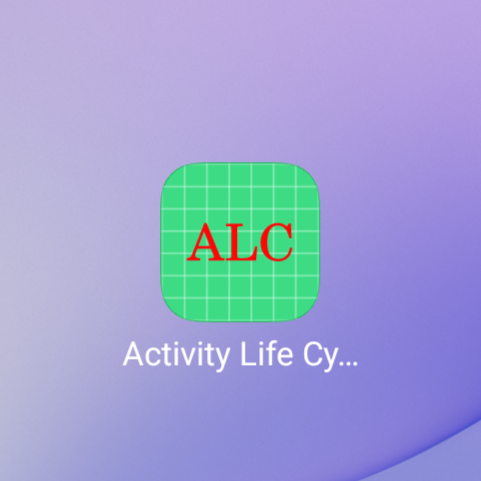
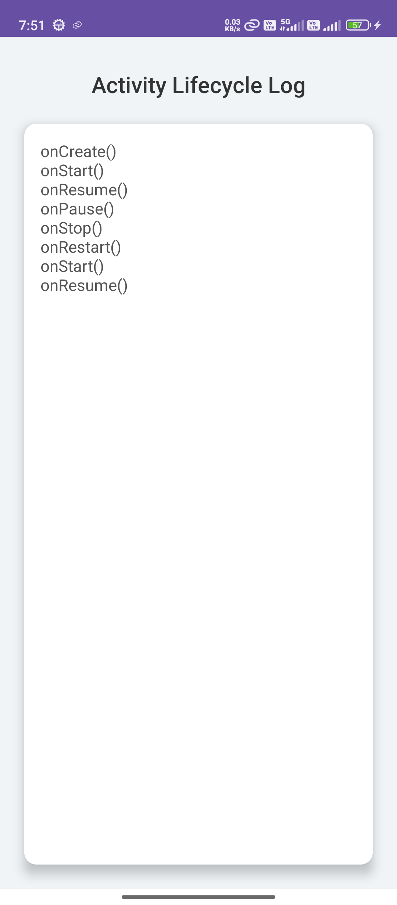
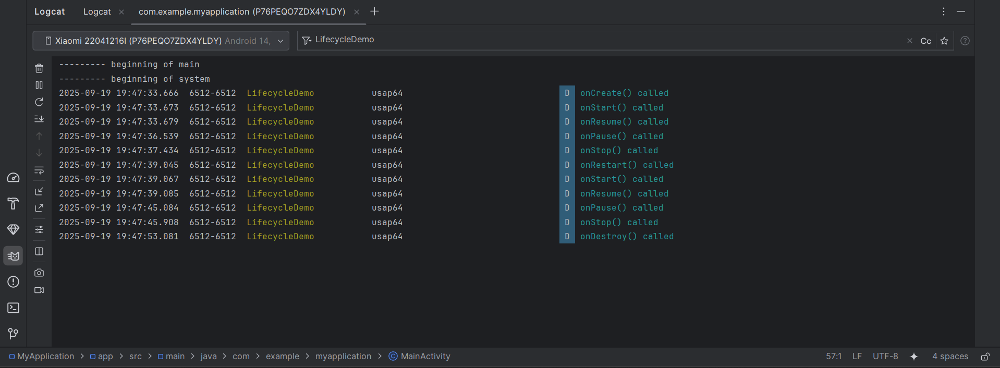

# 📱 Android Activity Lifecycle Log App

This is a simple Android application that demonstrates the **Activity Lifecycle**.
It shows lifecycle method calls (`onCreate`, `onStart`, `onResume`, `onPause`, `onStop`, `onRestart`, `onDestroy`) using:

* ✅ Logcat messages
* ✅ Toast messages
* ✅ TextView updates

---

## 🚀 Features

* Displays lifecycle state on screen inside a **CardView**.
* Logs lifecycle events in **Logcat**.
* Shows **Toast pop-ups** for each lifecycle method.
* Custom app icon with **ALC logo**.

---

## 📂 Project Setup

1. Clone the repo:

   ```bash
   git clone https://github.com/khatriharsh08/ActivityLifeCycle.git
   ```
2. Open the project in **Android Studio**.
3. Build & Run on Emulator/Physical Device.

---

## 📸 Screenshots

### App Icon



### Display View



### Logcat Output



---

## 🎥 Demo Video

👉 [Watch Demo Video](screenshots/ScrollView.mp4)

*(If GitHub preview doesn’t work, download and play locally.)*

---

## 📖 Android Lifecycle Flow


---

## 🛠️ Tech Stack

* Java (Android)
* Gradle
* Android Studio
